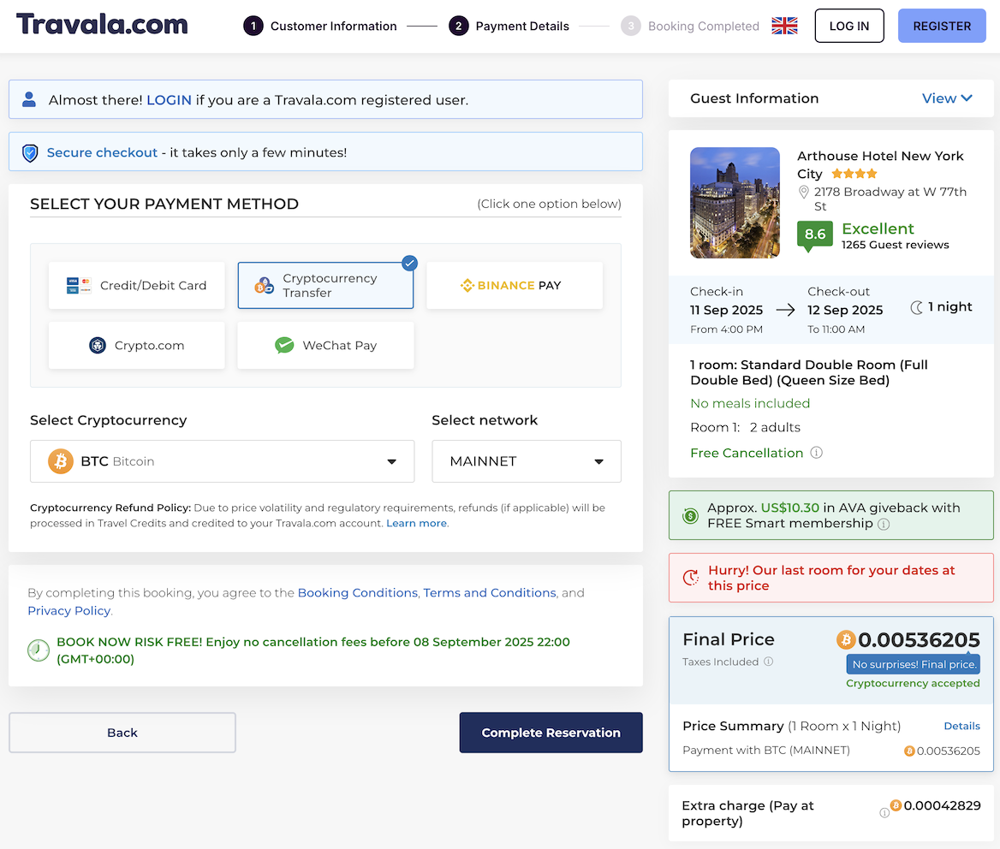
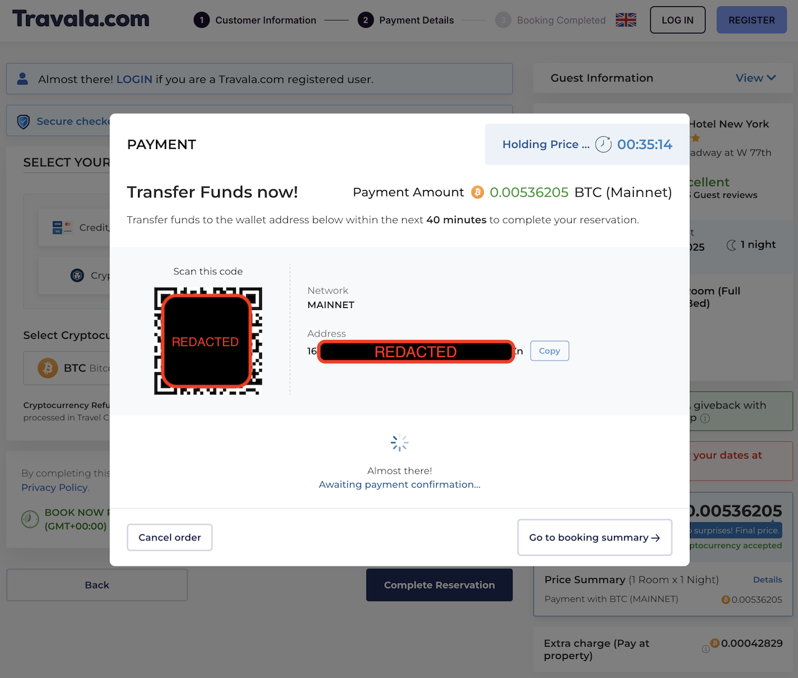

# Off-ramping: where and how to spend your cryptocurrency

At the end of the day, cryptocurrency is just currency. You can't breathe it, you can't eat it, you can't drink it. It won't provide companionship, fulfillment, inspiration, or joy. A number in a bank account, or a cryptocurrency wallet, won't keep you alive. Sooner or later, you're going to have to spend it on something.

The cryptocurrency world calls this "off-ramping," the complement to "on-ramping." In this case, it means turning your cryptocurrency assets into something else, whether digital or physical.

In the traditional financial system, spending money comes with a privacy trade-off: your bank, credit card company, or payment processor knows what you're up to. Transparent (non-private) cryptocurrency systems suffer from the same problem, but worse, because everyone in the entire world can watch what you buy. This is one of the main safety benefits to using privacy coins: no one but you and the vendor you're buying from knows what you're up to.

## In this article

1. [Paying directly in cryptocurrency](#paying-directly-in-cryptocurrency)
    1. [Paying in Bitcoin when you only have Zcash](#paying-in-bitcoin-when-you-only-have-zcash)
1. [Use specialty gift card and exchange service providers](#use-specialty-gift-card-and-exchange-service-providers)
    1. [Pay for stuff via Flexa in Zashi](#pay-for-stuff-via-flexa-in-zashi)
    1. [Common cryptocurrency to gift card off-ramps (for sex workers)](#common-cryptocurrency-to-gift-card-off-ramps-for-sex-workers)
    1. [Recommended crypto gift card marketplace vendors](#recommended-crypto-gift-card-marketplace-vendors)
1. [Put yourself on a crypto payroll with Opolis](#put-yourself-on-a-crypto-payroll-with-opolis)
1. [Convert crypto back to fiat currency](#convert-crypto-back-to-fiat-currency)

## Paying directly in cryptocurrency

The easiest way to off-ramp or spend your cryptocurrency is to just pay for the thing in the same privacy coin you already have. Of course, this requires the vendor to accept payments in that privacy coin, and that's still rare.

It's worth pointing out that, as sex workers, we are actually quite a skilled bunch. As I'm sure you know (and as [I've said before](https://bsky.app/profile/violetrollergirl.com/post/3lx34gxh3tk2i){:target="_blank"}), sex work requires myriad skills, and most sex workers are gig workers, which means you can support many of the sex workers you know even without buying hole or pole from us. I personally know colleagues who are editors, tailors, graphic designers, leather workers, bartenders, computer programmers, cooks, tutors, and nannies who also do sex work as a supplemental income.

Community's always been important but it'll become more so very rapidly. If the quality is there, I'd rather get my blouse sewn by a fellow sex worker I know or one who is recommended to me by a friend. And, guess what, if they're willing to accept payment for that service in Zcash, I've got my perfect off-ramp right there!

So if you're a sex worker with such skills, share that fact with friends you trust. Build a local economy, and stay surveillance-free by using Zcash to sustain it! The true revolutionary potential of this truly cannot be overstated.

One way to think about this is: Zcash in Zashi is to money what Signal Private Messenger is to speech. Vive la révolution!

### Paying in Bitcoin when you only have Zcash

One very common need we have is to pay for our escort ads. Many escort directories and mall sites will accept payment in Bitcoin, but I'm aware of none who accept Zcash. (Obviously, if you know of one, please [contact](#contact) me to tell me about it!) Thankfully, once again Zashi comes to the rescue with a [decentralized off-ramp for shielded ZEC built into Zashi itself](https://electriccoin.co/blog/live-in-zashi-decentralized-off-ramp-for-shielded-zec/){:target="_blank"}.

Let's say you have some ZEC and you want to [load up your Tryst TLC balance](https://help.tryst.link/en-gb/22-payments-accounts/86-managing-your-membership){:target="_blank"}. Here's what you can do:

1. First, since you already have ZEC in Zashi, it's shielded and private. This means no matter how you got it, it bears no digital link back to your legal identity. This is a much better place to start than any other Bitcoin address.
1. Log in to your Tryst account and access their "[Add credits](https://app.tryst.link/members/orders/new){:target="_blank"}" screen.
1. Since this is your first time paying in ZEC, choose to purchase a small "Custom" amount of TLC, maybe 15 or so.
1. Make sure you indicate that you want to pay in Bitcoin. You're actually going to be paying directly from your shielded Zcash, but Tryst will nevertheless receive Bitcoin anyway.
1. Click the "Next" button to proceed to [the Tryst order summary screen](https://help.tryst.link/en-gb/22/146){:target="_blank"}.
1. Review your purchase order and press the "Pay Now" button to reveal the Bitcoin pay window. Tryst will show you a QR code that's similar to Zashi's "Request" screen, with an amount already embedded in it. That's nice, but we're not going to use it.
1. Click on the "Copy" tab to reveal just the Bitcoin address that Tryst is expecting to receive your payment at.
1. Click on the address itself (*not* the "payment link") to copy the Bitcoin address to your clipboard. Keep a note of this address somewhere, like a text window or just in your clipboard. We'll need it later.
1. Now, open Zashi.
1. Click on Zashi's "More&hellip;" button to reveal its menu of advanced options.
1. Choose "Swap ZEC with NEAR Intents," which is currently the first (top) item in the resulting menu.
1. Enter an amount slightly *more* than the amount of the purchase order you requested from Tryst. For example, if you asked for 15 TLC (which maps directly to 15 Euro), enter an amount of ZEC equivalent to 20 Euros. Zashi will show you the current exchange rate, and you can also tap the up-and-down-arrows icon underneath the payment entry amount field to switch from entering ZEC to entering your chosen fiat currency.
1. Beneath this field is a drop-down menu for selecting the currency we are going to pay in. Find `BTC` from the list of options; it will have a small Bitcoin logo on top of a larger, second, identical Bitcoin logo. This means we're using our shielded ZEC, but paying in Bitcoin.
1. Make sure the fiat amount of BTC shows up as larger than the purchase order amount you requested from Tryst.
1. In the `Address` field, paste the Bitcoin payment address you copied from Tryst earlier.
1. Click "Get a quote" at the bottom of the Zashi Swap with NEAR screen.
1. Confirm you want to make the exchange, and send the transaction.

In my experience, it takes about 5 to 10 minutes for the transaction to complete.

There's a lot happening here, but what's extra cool about this is that at no point do you need a Bitcoin wallet, nor does any remnant of digital cruft exist anywhere in the blockchain that can be linked back to you. You can keep your cryptocurrency assets in the Zcash shielded pool, completely privately, and now pay any vendor who accepts any denomination of cryptocurrency that's supported in this neat little feature equally privately.

This is in fact how I pay for [my Tryst membership](#links-tryst).

## Use specialty gift card and exchange service providers

Today, among the most common ways to spend your hard-earned cryptocurrency is by bridging it into the massive "gift card economy" for making various kinds of retail purchases. One thing that's nice about this for us as sex workers in particular is that many of us are already very familiar with gift cards and similar store credit services. We may even have regular business expenses such as a prepaid mobile phone (<acronym title="electronic subscriber identity module">eSIM</acronym>) line or hotel bookings we need to make to run our business.

Since gift cards and store credit systems are already a certain kind of alternative digital local currency, cryptocurrency is a natural fit. As a result, an entire *crypto gift card marketplace* (sometimes also called the broader "peer-to-peer (P2P) crypto marketplace") industry has emerged to support this way of off-ramping cryptocurrency funds. While different crypto-to-gift-card exchange service providers support different currencies, [Zashi's built-in decentralized exchange ZEC off-ramp](#paying-in-bitcoin-when-you-only-have-zcash) solves that problem, so the main considerations for those of us who want to use this method to spend our cryptocurrency funds are:

- finding a crypto to gift card exchange provider that partners with a brand we want to spend on, and
- ensuring that the exchange provider's terms of use and their ["Know Your Customer" rules]() doesn't risk our privacy more than we are comfortable with.

I strongly suggest talking to your friends and colleagues about what services they like and feel safe using, and why. But if you're just starting from scratch, read on to learn about my favorite services.

### Pay for stuff via Flexa in Zashi

One crypto gift card marketplace vendor in particular deserves a special mention, [Flexa](https://flexa.co/){:target="_blank"}, because you can use them directly from [my favorite Zcash wallet app, Zashi](#zashi-privacy-focused-zcash-wallet-app). If you've installed the mainstream version of Zashi (i.e., from the Google Play Store or the Apple App Store, but *not* from the [F-Droid strictly free software app repository](https://f-droid.org/en/packages/co.electriccoin.zcash.foss/){:target="_blank"}), you'll have the option to spend your shielded ZEC from within your Zashi wallet by converting it directly to a Flexa account balance, which is basically a multi-store gift card manager mini-app inside Zashi itself.

As of this writing, some Flexa partners include [Ulta Beauty](https://www.ulta.com/){:target="_blank"} and [Kiehl's](https://www.kiehls.com/){:target="_blank"} (cosmetic and skincare product brands, useful for the obvious reasons), [Sheetz](https://www.sheetz.com/){:target="_blank"} (a convenience store and gas station chain, useful if you often drive yourself to outcalls), and [Chipotle](https://www.chipotle.com/){:target="_blank"}, which I guess is mostly noteworthy for personal reasons because one of my partners loves Mexican food, so I get to treat them here often. :)

First, set up Zashi to work with Flexa as privately as possible by [enabling Zashi's built-in Tor network privacy features](https://electriccoin.co/blog/zashi-2-1-enhanced-privacy-with-tor-beta/){:target="_blank"}. Once that's set up **do this to use Flexa from within Zashi:**

1. Open your Zashi wallet app. Make sure have some ZEC in it, enough to cover the cost of the thing you're about to buy in the local fiat currency where you're buying it (such as in US Dollars if you're in the United States).
1. Tap the "More&hellip;" button in the Zashi main screen.
1. Tap the "Pay with Flexa" item in the resulting list.
1. If this is the first time you've used Flexa, you'll be asked to complete a brief registration process where you are asked for your name and email address. At this point, there are a few things you should know:
    - While Flexa will have this information, none of it will end up on the Zcash blockchain network nor with the ultimate merchant from which you are buying something.
    - At the moment, [Flexa limits your spending to $750 USD per week](https://support.flexa.co/en/articles/3142914-how-much-can-i-spend-using-flexa){:target="_blank"}. As a result, [Flexa is not required to share any of your off-ramping activity with the US government's Internal Revenue Service (IRS, the tax man)](https://support.flexa.co/en/articles/3142914-how-much-can-i-spend-using-flexa){:target="_blank"}.
    - I signed up with Flexa using a name that is not my legal name and an email address that is not one I use for my legal identity, and I was still able to buy stuff by funding it with my Zcash balance. You can do the same. (Try using [Firefox Relay](https://relay.firefox.com/){:target="_blank"} for your masked email address.)
1. Once you have a Flexa account, you'll be given a "Flexa QR code" that is basically just a barcode that participating brands can scan as a native payment. It's that easy. But you'll also see a "More instant payments" box at the bottom of your screen. These are "legacy Flexa brands," which are the stores at which you need to tell the cashier that you want to pay using a "gift card" or "store credit." To use these:
    1. Tap the logo icon for the brand you want to pay for, such as Chipotle. This will let you create a one-time use virtual gift card and load it up using your Zcash funds.
    1. Enter the amount you owe at the register. If the cashier tells you that your total is $20 USD, enter that amount under the Chipotle logo.
    1. Press or tap the *Confirm* button. A new brand-specific virtual gift card QR code will appear.
    1. Tell the cashier you have your gift card ready. They will ask you to scan it. Do so, and you'll have paid!

I have successfully used Flexa this way and, while it's currently limited to supported business partners, it is by far the easiest way to spend my ZEC on real, physical stuff.

Of course, if you need something from a store that doesn't have a Flexa partnership, you can still maybe find it from another cryptocurrency to gift card exchange provider.

### Common cryptocurrency to gift card off-ramps (for sex workers)

When you're using the gift card economy to spend your cryptocurrency, the first challenge is figuring out which service can get you a gift card from a brand you want to purchase from. To help you get started, here's a few of the more useful items I've been able to find off-ramps for, and where I found them.

- [Digital pre-paid Visa credit card (via Bitrefill)](https://www.bitrefill.com/us/en/gift-cards/virtual-prepaid-visa-usa/) - Perhaps the most generically useful crypto off-ramp via the gift card economy is simply a pre-paid credit card. You pay in crypto and get a legitimate digital pre-paid credit card number that has a fiat balance you paid for using your cryptocurrency balance. You can also get [physical pre-paid credit cards](https://www.bitrefill.com/us/en/gift-cards/physical-prepaid-visa-usa/) mailed to you.
- [Amazon Gift Card (via Bitrefill)](https://www.bitrefill.com/us/en/gift-cards/amazon_com-usa/) - This gift card is good for anything sold at Amazon.com, not that I'm trying to encourge you to give Daddy Bezos more money, but, y'know&hellip;.
- [Ulta Beauty Gift Card (via Bitrefill)](https://www.bitrefill.com/us/en/gift-cards/ulta-beauty-usa/) - Ever since I started using cryptocurrency more in my everyday life, this cosmetics retailer has become my go-to for makeup and simple skincare needs. [Flexa from within the Zashi wallet app](#pay-for-stuff-with-flexa-in-zashi) also supports filling Ulta Beauty gift cards.
- [Amtrak Gift Card (via Bitrefill)](https://www.bitrefill.com/us/en/gift-cards/amtrak-usa/) - Since I service clients in numerous cities clustered along Amtrak lines on the United States' East Coast, this is a particularly convenient off-ramp for me and I imagine other <abbr title="Train Me To You">TMTY</abbr> providers would want to know about it, too.
- [Lyft Gift Card](https://www.bitrefill.com/us/en/gift-cards/lyft-usa/) or [Uber Gift Card](https://www.bitrefill.com/us/en/gift-cards/uber-usa/) (via Bitrefill) - For the obvious reasons.
- [Hotel bookings (via Travala)](https://www.travala.com/?tab=hotels) - Sometimes, such as [when I'm on tour](#tours), I need to book hotels or otherwise make [hotel arrangements](#hotel-arrangements) to coordinate an incall, and Travala comes in clutch. It works like you'd expect any other hotel booking platform does, but watch what happens at the payment screen:
    - [Travala's payment options](https://www.travala.com/payment-options) includes direct cryptocurrency transfer with dozens upon dozens of different supported cryptocurrencies, including the popular ones. While Travala doesn't support Zcash, remember you can still [use Zashi's decentralized off-ramp to pay in Bitcoin](#paying-in-bitcoin-when-you-only-have-zcash) directly from your Zcash balance. Here's a screenshot of a reservation about to be paid in Bitcoin.
        
    - And here's what happens when you press the "Complete Reservation" button.
        
        Kinda looks like Tryst's payment screen, doesn't it?
- [Flight reservations (via Travala)](https://www.travala.com/?tab=flights) - You can also buy airline tickets this same way.

### Recommended crypto gift card marketplace vendors

- [Bitrefill](https://www.bitrefill.com/){:target="_blank"}, one of the largest gift card cryptocurrency off-boarding sites, and the one I've mentioned more than any other already. Bitrefill sells gift cards to a plethora of well-known brands by accepting cryptocurrency as payment for them.
- [Travala](https://www.travala.com/){:target="_blank"}, a site designed for booking hotels, flights, tours, and other activities by paying in your cryptocurrency of choice, mentioned above as well.

## Put yourself on a crypto payroll with Opolis

> This needs a write up, as well. It basically involves engaging the services of an independent worker's cooperative such as [Opolis](https://opolis.co/){:target="_blank"} and then paying them crypto for which they will give you fiat currency in exchange, as an employed worker. This also means you can get health benefits with their plan, and so on. More to come about this exciting option!

## Convert crypto back to fiat currency

> I need to write this up, too. Basically it's just going back to an exchange where you are okay KYC'ing to your fiat identity.

{:.button-container}
  
