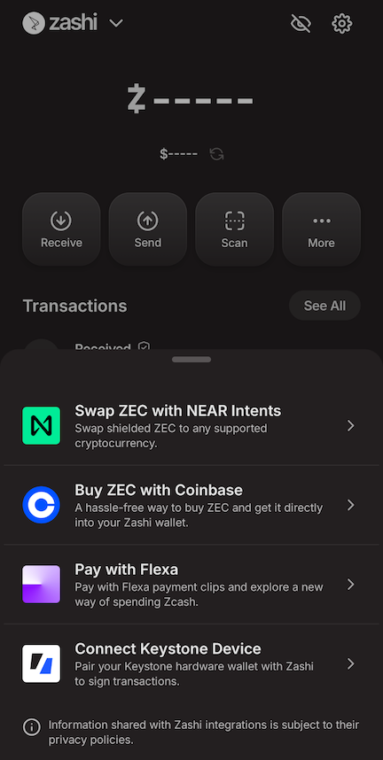
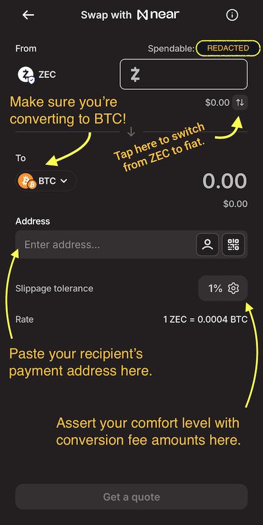

# Off-ramping: where and how to spend your cryptocurrency

At the end of the day, cryptocurrency is just currency. You can't breathe it, you can't eat it, you can't drink it. It won't provide companionship, fulfillment, inspiration, or joy. A number in a bank account, or a cryptocurrency wallet, won't keep you alive. Sooner or later, you're going to have to spend it on something.

The cryptocurrency world calls this "off-ramping," the complement to "on-ramping." In this case, it means turning your cryptocurrency assets into something else, whether digital or physical.

In the traditional financial system, spending money comes with a privacy trade-off: your bank, credit card company, or payment processor knows what you're up to. Transparent (non-private) cryptocurrency systems suffer from the same problem, but worse, because everyone in the entire world can watch what you buy. This is one of the main safety benefits to using privacy coins: no one but you and the vendor you're buying from knows what you're up to.

## In this article

1. [Paying directly in cryptocurrency](#paying-directly-in-cryptocurrency)
    1. [Paying in Bitcoin when you only have Zcash](#paying-in-bitcoin-when-you-only-have-zcash)
1. [Piggyback on the gift card economy](#piggyback-on-the-gift-card-economy)
    1. [Pay for stuff via Flexa in Zashi](#pay-for-stuff-via-flexa-in-zashi)
    1. [Common cryptocurrency to gift card off-ramps (for sex workers)](#common-cryptocurrency-to-gift-card-off-ramps-for-sex-workers)
1. [Use specialty exchange service providers](#use-specialty-exchange-service-providers)
    1. [Booking hotel stays and air travel with cryptocurrency](#booking-hotel-stays-and-air-travel-with-cryptocurrency)
1. [Join a digital employment cooperative that accepts cryptocurrency](#join-a-digital-employment-cooperative-that-accepts-cryptocurrency)
    1. [Opolis: a crypto-native independent employment platform](#opolis-a-crypto-native-independent-employment-platform)
1. [Convert crypto back to fiat currency](#convert-crypto-back-to-fiat-currency)

## Paying directly in cryptocurrency

The easiest way to off-ramp or spend your cryptocurrency is to just pay for the thing in the same privacy coin you already have. Of course, this requires the vendor to accept payments in that privacy coin, and that's still rare.

It's worth pointing out that, as sex workers, we are actually quite a skilled bunch. As I'm sure you know (and as [I've said before](https://bsky.app/profile/violetrollergirl.com/post/3lx34gxh3tk2i){:target="_blank"}), sex work requires myriad skills, and most sex workers are gig workers, which means you can support many of the sex workers you know even without buying hole or pole from us. I personally know colleagues who are editors, tailors, graphic designers, leather workers, bartenders, computer programmers, cooks, tutors, and nannies who also do sex work as a supplemental income.

Community's always been important but it'll become more so very rapidly. If the quality is there, I'd rather get my blouse sewn by a fellow sex worker I know or one who is recommended to me by a friend. And, guess what, if they're willing to accept payment for that service in Zcash, I've got my perfect off-ramp right there!

So if you're a sex worker with such skills, share that fact with friends you trust. Build a local economy, and stay surveillance-free by using Zcash to sustain it! The true revolutionary potential of this truly cannot be overstated.

One way to think about this is: [Zcash](https://z.cash/){:target="_blank"} in [Zashi](https://electriccoin.co/zashi/){:target="_blank"} is to money what [Signal Private Messenger](https://signal.org/){:target="_blank"} is to speech. Vive la révolution!

### Paying in Bitcoin when you only have Zcash

Although Zcash is a superior private currency, most of the crypto world still relies on other systems, like Bitcoin. Thankfully, cryptocurrencies can be easily converted from one to another so it's easy to pay in a vendor's cryptocurrency of choice even if you only keep a balance in Zcash. You just have to be careful about exchange rates, conversion fees, and payment processing times.

Let's work through a common use case I have one step at a time.

One very common need I have is to pay for my escort ads. Many escort directories and mall sites will accept payment in Bitcoin, but I'm aware of none who accept Zcash. (Obviously, if you know of one, please [contact](#contact) me to tell me about it!) Thankfully, once again my Zashi wallet app comes in handy here, because it has a [decentralized off-ramp for shielded ZEC built into Zashi itself](https://electriccoin.co/blog/live-in-zashi-decentralized-off-ramp-for-shielded-zec/){:target="_blank"}.

Suppose you have some ZEC and you want to [load up your Tryst TLC balance](https://help.tryst.link/en-gb/22-payments-accounts/86-managing-your-membership){:target="_blank"}. Here's what you can do. And remember that since you already have ZEC in Zashi, it's already shielded and private, meaning no matter how you got it, it bears no digital link back to your legal identity. This is a much better place to start than any other Bitcoin address.

1. First, [log in to your Tryst account](https://app.tryst.link/log_in){:target="_blank"} and access their "[Add credits](https://app.tryst.link/members/orders/new){:target="_blank"}" screen.

    

1. Since this is your first time paying in ZEC, choose to purchase a small "Custom" amount of TLC, maybe `15` or so.
1. Make sure you indicate that you want to pay in Bitcoin. You're actually going to be paying directly from your shielded Zcash, but Tryst will nevertheless receive Bitcoin anyway.

    

1. Click the "Next" button to proceed to [the Tryst order summary screen](https://help.tryst.link/en-gb/22/146){:target="_blank"}.
1. Review your purchase order for correctness and press the "Pay Now" button to reveal the Bitcoin pay window.

    

1. Tryst will show you a QR code that's similar to Zashi's "Request" screen, with an amount already embedded in it. That's nice, but we're not going to use it because that QR code is intended for Bitcoin wallet apps, and we're using a Zcash wallet app.
1. Click on the "Copy" tab to reveal just the Bitcoin address that Tryst wants you to send your payment to. It'll look like the *right* screenshot in the image below.

    

1. Click on the address itself (*not* the "payment link") to copy the Bitcoin address to your clipboard. Keep a note of this address somewhere, like a text window or just in your clipboard. We'll need it later. I like to use [Signal's "Note to self" feature](https://support.signal.org/hc/en-us/articles/360043272451-Note-to-Self){:target="_blank"}, which is also a secure way to send it to my other devices if I'm not already doing this all from one device.
1. Now, open Zashi.
1. Click on Zashi's "More&hellip;" button to reveal its menu of advanced options.
1. Choose "Swap ZEC with NEAR Intents," which is currently the first (top) item in the resulting menu. Here's what that looks like for me.

    

1. Enter an amount slightly *more* than the amount of the purchase order you requested from Tryst. For example, if you asked for 15 TLC (which maps directly to 15 Euro), enter an amount of ZEC equivalent to 20 Euros. By default, you'll be entering an amount in ZEC, but you can also tap the up-and-down-arrows icon underneath the payment entry amount field to switch to entering your chosen fiat currency. Zashi will show you the current exchange rate either way.
1. Beneath this field is a drop-down menu for selecting the currency we are going to pay in. Find `BTC` from the list of options; it will have a small Bitcoin logo on top of a larger, second, identical Bitcoin logo. This means we're using our shielded ZEC, but paying in Bitcoin.
1. Make sure the fiat amount of BTC shows up as larger than the purchase order amount you requested from Tryst.
1. In the `Address` field, paste the Bitcoin payment address you copied from Tryst earlier.
1. Click "Get a quote" at the bottom of the Zashi Swap with NEAR screen. Here's an annotated screenshot of what it looks like.

    

1. Confirm you want to make the exchange, and send the transaction.

In my experience, it takes about 5 to 10 minutes for the transaction to complete, so make sure you have at least that much time on the Tryst payment timer before you confirm your transaction, or you may not be able to get your account credited before your purchase order expires and you'll have to speak with support about hopefully getting a refund.

There's a lot of sparkle-emoji technology sparkle-emoji happening here, but what's extra cool about this is that at no point do you ever need a Bitcoin wallet! Moreover, no remnant of digital cruft exist anywhere in the various blockchains that can be meaningfully linked back to you. While the vendor you're purchasing from may know who you are (and Tryst certainly does), they don't know where your funds came from, and they don't care.

Practically, this enables you to safely keep your cryptocurrency assets in the Zcash shielded pool, where they stay completely private, and still be able to pay any vendor who accepts any denomination of a supported cryptocurrency equally privately. If you do this, no one can know how rich (or poor) you really are. In contrast, if you keep your holdings in a transparent ledger system like Bitcoin, the whole world can tally your real net worth without ever asking you questions.

This is not a hypothetical example. This is in fact how I pay for [my Tryst membership and other ads](#links-group-ad-listings). Consider trying it out for your next cryptocurrency payment, too.

## Piggyback on the gift card economy

Among the most common ways to spend your hard-earned cryptocurrency today is by piggybacking on the massive gift card economy for making various kinds of retail purchases. One thing that's nice about this for us as sex workers in particular is that many of us are already very familiar with gift cards and similar store credit services. We may even have regular business expenses such as a prepaid mobile phone (<acronym title="electronic subscriber identity module">eSIM</acronym>) line or hotel bookings we need to make to run our business.

Since gift cards and store credit systems are already a certain kind of alternative digital local currency, cryptocurrency is a natural fit. As a result, an entire *crypto gift card marketplace* industry has emerged to support this particular off-ramp. While different crypto-to-gift-card exchange service providers support different currencies, [Zashi's built-in decentralized exchange ZEC off-ramp](#paying-in-bitcoin-when-you-only-have-zcash) solves that problem, so the main considerations for those of us who want to use this method to spend our cryptocurrency funds are:

- finding a crypto to gift card exchange provider that partners with a brand we want to buy from, and
- ensuring that the exchange provider's terms of use and their ["Know Your Customer" rules]() doesn't risk our privacy more than we are comfortable with.

I strongly suggest talking to your friends and colleagues about what services they like and feel safe using, and why. But if you're just starting from scratch, read on to learn about my favorite services.

### Pay for stuff via Flexa in Zashi

One crypto gift card marketplace vendor in particular deserves a special mention, [Flexa](https://flexa.co/){:target="_blank"}, because you can use them directly from [my favorite Zcash wallet app, Zashi](#zashi-privacy-focused-zcash-wallet-app). If you've installed the mainstream version of Zashi (i.e., from the Google Play Store or the Apple App Store, but *not* from the [F-Droid strictly free software app repository](https://f-droid.org/en/packages/co.electriccoin.zcash.foss/){:target="_blank"}), you'll have the option to spend your shielded ZEC from within your Zashi wallet by converting it directly to a Flexa account balance, which is basically a multi-store gift card manager mini-app inside Zashi itself.

As of this writing, some Flexa partners include [Ulta Beauty](https://www.ulta.com/){:target="_blank"} and [Kiehl's](https://www.kiehls.com/){:target="_blank"} (cosmetic and skincare product brands, useful for the obvious reasons), [Sheetz](https://www.sheetz.com/){:target="_blank"} (a convenience store and gas station chain, useful if you often drive yourself to outcalls), and [Chipotle](https://www.chipotle.com/){:target="_blank"}, which I guess is mostly noteworthy for personal reasons because one of my partners loves Mexican food, so I get to treat them here often. :)

First, set up Zashi to work with Flexa as privately as possible by [enabling Zashi's built-in Tor network privacy features](https://electriccoin.co/blog/zashi-2-1-enhanced-privacy-with-tor-beta/){:target="_blank"}. Once that's set up **do this to use Flexa from within Zashi:**

1. Open your Zashi wallet app. Make sure have some ZEC in it, enough to cover the cost of the thing you're about to buy in the local fiat currency where you're buying it (such as in US Dollars if you're in the United States).
1. Tap the "More&hellip;" button in the Zashi main screen.
1. Tap the "Pay with Flexa" item in the resulting list.
1. If this is the first time you've used Flexa, you'll be asked to complete a brief registration process where you are asked for your name and email address. At this point, there are a few things you should know:
    - While Flexa will have this information, none of it will end up on the Zcash blockchain network nor with the ultimate merchant from which you are buying something.
    - At the moment, [Flexa limits your spending to $750 USD per week](https://support.flexa.co/en/articles/3142914-how-much-can-i-spend-using-flexa){:target="_blank"}. As a result, [Flexa is not required to share any of your off-ramping activity with the US government's Internal Revenue Service (IRS, the tax man)](https://support.flexa.co/en/articles/3142914-how-much-can-i-spend-using-flexa){:target="_blank"}.
    - I signed up with Flexa using a name that is not my legal name and an email address that is not one I use for my legal identity, and I was still able to buy stuff by funding it with my Zcash balance. You can do the same. (Try using [Firefox Relay](https://relay.firefox.com/){:target="_blank"} for your masked email address.)
1. Once you have a Flexa account, you'll be given a "Flexa QR code" that is basically just a barcode that participating brands can scan as a native payment. It's that easy. But you'll also see a "More instant payments" box at the bottom of your screen. These are "legacy Flexa brands," which are the stores at which you need to tell the cashier that you want to pay using a "gift card" or "store credit." To use these:
    1. Tap the logo icon for the brand you want to pay for. This will let you create a one-time use virtual gift card and load it up using your Zcash funds.
    1. Enter the amount you owe at the register. If the cashier tells you that your total is $20 USD, enter that amount under the brand's logo.
    1. Press or tap the *Confirm* button. A new brand-specific virtual gift card QR code will appear.
    1. Tell the cashier you have your gift card ready. They will ask you to scan it. Do so, and you'll have paid!

I have successfully used Flexa this way and, while it's currently limited to supported business partners, it is by far the easiest way to spend my ZEC on real, physical stuff.

If you need something from a store that doesn't have a Flexa partnership, you can still maybe find it from another cryptocurrency to gift card vendor.

### Common cryptocurrency to gift card off-ramps (for sex workers)

When you're using the gift card economy to spend your cryptocurrency, the first challenge is figuring out which service can get you a gift card from a brand you want to purchase from.

The cryptocurrency to gift card vendor I know most about is [Bitrefill](https://www.bitrefill.com/){:target="_blank"}, because they're one of the largest. Bitrefill sells gift cards to a plethora of well-known brands by accepting cryptocurrency as payment for them. Bitrefill is easy to navigate, but I've nevertheless compiled the below list of useful items to help you imagine what's possible.

- [Digital pre-paid Visa credit card (via Bitrefill)](https://www.bitrefill.com/us/en/gift-cards/virtual-prepaid-visa-usa/){:target="_blank"} - Perhaps the most generically useful crypto off-ramp via the gift card economy is simply a pre-paid credit card. You pay in crypto and get a legitimate digital pre-paid credit card number that has a fiat balance you paid for using your cryptocurrency balance. You can also get [physical pre-paid credit cards](https://www.bitrefill.com/us/en/gift-cards/physical-prepaid-visa-usa/){:target="_blank"} mailed to you.
- [Amazon Gift Card (via Bitrefill)](https://www.bitrefill.com/us/en/gift-cards/amazon_com-usa/){:target="_blank"} - This gift card is good for anything sold at Amazon.com, not that I'm trying to encourge you to give Daddy Bezos more money, but, y'know&hellip;.
- [Ulta Beauty Gift Card (via Bitrefill)](https://www.bitrefill.com/us/en/gift-cards/ulta-beauty-usa/){:target="_blank"} - Ever since I started using cryptocurrency more in my everyday life, this cosmetics retailer has become my go-to for makeup and simple skincare needs. [Flexa from within the Zashi wallet app](#pay-for-stuff-with-flexa-in-zashi) also supports filling Ulta Beauty gift cards.
- [Amtrak Gift Card (via Bitrefill)](https://www.bitrefill.com/us/en/gift-cards/amtrak-usa/){:target="_blank"} - Since I service clients in numerous cities clustered along Amtrak lines on the United States' East Coast, this is a particularly convenient off-ramp for me and I imagine other <abbr title="Train Me To You">TMTY</abbr> providers would want to know about it, too.
- [Lyft Gift Card](https://www.bitrefill.com/us/en/gift-cards/lyft-usa/){:target="_blank"} or [Uber Gift Card](https://www.bitrefill.com/us/en/gift-cards/uber-usa/){:target="_blank"} (via Bitrefill) - For the obvious reasons.

You can also find gift cards for other common sex worker business needs, including airline and hotel bookings. However, remember that the gift card economy is still actually part of the fiat economy. When possible, it's best to avoid converting your cryptocurrency back to fiat currency, whether to avoid privacy incursions or simply due to the inconvenience. That's where [specialty services](#use-specialty-exchange-service-providers) come in.

## Use specialty exchange service providers

Instead of gift cards, which is really just a roundabout way to help fiat economy vendors accept cryptocurrency without actually accepting cryptocurrency payments, there are also a class of business-to-consumer middlemen that will accept payments in cryptocurrency and interface with vendors on your behalf.

### Booking hotel stays and air travel with cryptocurrency

[When I'm on tour](#tours), I often need to buy airline tickets or make [hotel arrangements](#hotel-arrangements) to coordinate an incall. This is where [Travala](https://www.travala.com/){:target="_blank"} comes in clutch. It works like you'd expect any other flight and hotel booking platform does, but watch what happens at the payment screen:

[Travala's payment options](https://www.travala.com/payment-options) includes direct cryptocurrency transfer with dozens upon dozens of different supported cryptocurrencies, including the popular ones. While Travala doesn't support Zcash, remember you can still [use Zashi's decentralized off-ramp to pay in Bitcoin](#paying-in-bitcoin-when-you-only-have-zcash) directly from your Zcash balance. Here's a screenshot of a reservation about to be paid in Bitcoin.

And here's what happens when you press the "Complete Reservation" button.

Kinda looks like Tryst's payment screen, doesn't it?

You can also [buy airline tickets on Travala](https://www.travala.com/?tab=flights){:target="_blank"} this same way.

## Join a digital employment cooperative that accepts cryptocurrency

So far, the cryptocurrency off-ramping options I've described largely avoid unnecessary interaction with the fiat economy. Turning away from traditional financial and governmental systems is becoming increasingly important. However, it can also brand us illegitimate to individuals or institutions who do interact with that world and who, for whatever reason, we are also forced to interact with.

Unfortunately, lacking traditional legitimacy often means lacking important safety nets that come with traditional employment like medical/health insurance and retirement plan benefits. It also means struggling to show proof of income in many situations where we still need it, such as taking out a fiat loan or renting from a landlord. Importantly, this frustration isn't unique to sex workers! While stigma against sex work makes even more obstacles for us in these situations, on paper these challenges are similar to those faced by freelancers more generally.

Let me be absolutely clear about this: I firmly believe the current system is unredeemable. As the fiat world continues failing to provide many of us our most basic needs, alternatives will be urgent sooner rather than later. On a personal level, I don't even care why this empire is crumbling; whether my government failed me because it hates who I am as a trans woman or whether it failed me because it's flat out incompetent isn't something I have the luxury of thoroughly investigating. I just need a solution, and I need it yesterday.

One novel angle to attack this problem comes in the form of digital employment cooperatives, sometimes also called a freelancer's union (not to be confused with [The Freelancer's Union](https://www.freelancersunion.org/){:target="_blank"}). If you can join these institutions, they offer a way to legitimize your income, whether from fiat or cryptocurrency earnings. This means you get some of the benefits of traditional employment while letting you retain the freedom of being an independent worker.

While not suitable or available to everyone, this kind of thing is absolutely worth knowing about. So let's look at one such off-ramp.

### Opolis: a crypto-native independent employment platform

*Opolis* is a novel digital employment cooperative you may be able to join (if you meet certain minimum income or eligibility requirements based on your needs, see below) that can offer a way to legitimize your income, including any earnings you make from cryptocurrency transactions. After reading this, you can help me if you want to join Opolis yourself by joining via my referral link:

{:.align-center}


Rather than work "under the table," you set things up like a traditional business. In plain language, it works like this.

1. [Register a legal business entity, such as an S-Corp](https://opolis.co/explore/entity/){:target="_blank"} that, obviously, provides high-quality "consulting," "coaching," "personal continuing education," or similar kinds of services. I'm being perfectly honest when I say I've discussed nuances of the JavaScript programming language with some of my clients! My state of dress during those discussions is neither here nor there.
1. You then hire yourself as an employee of that business, so you can [pay yourself a salary out of the business's future revenue](https://opolis.co/explore/payroll/){:target="_blank"}.
1. Your business entity then partners (joins) with the Opolis business cooperative, which [collectively negotiates employee benefits like health insurance plans](https://opolis.co/explore/benefits/){:target="_blank"}.
1. Finally, your business in turn offers those employment benefits to you, the "human resource" (employee).

Yes, this tactic introduces complexity to your work. It means you have to go through the process of registering a business, like picking a name and [choosing which State is best for you to register your business in](https://opolis.co/entity/the-best-states-for-llc-formation-where-to-plant-your-roots/){:target="_blank"}. But the rubber meets the road when on-ramping same as it did, or even better than, before.

- [Getting paid directly in crypto](#getting-paid-directly-in-crypto) is no different, just show a client your QR code from a cryptocurrency wallet.
- You can use your registered business as a further shield for your individual privacy when using your corporate bank account linked to fiat payment apps, notably [Zelle](https://www.zelle.com/){:target="_blank"}. Just make sure you've registered your business in a privacy-friendly state like Delaware, Nevada, or Wyoming, and via a third-party registered agent.

Now that you're earning revenue on behalf of your business, you'll need to record those funds in some accounting software. (I prefer to use [GnuCash](https://www.gnucash.org/){:target="_blank"} for this, but I've also heard good things about [Rotki](https://rotki.com/){:target="_blank"}.) This way, you can treat it as your business's *taxable income* for reporting purposes when your business pays member dues in cryptocurrencies Opolis supports. Yes, it also means you're now going to pay taxes; that's the cost of fiat legitimacy.

As a trans sex worker, my main motivation for looking into this option is [my need for safe and reliable <abbr title="Hormone Replacement Therapy">HRT</abbr> medicine (it's expensive to be trans in America)](https://bsky.app/profile/violetrollergirl.com/post/3lb3dhxcwvk2l){:target="_blank"}. Unfortunately, [Opolis has minimum income requirements](https://web.archive.org/web/20240901041819if_/https://opolis.co/wp-content/uploads/2024/05/2024-OPOLIS_map_minimum_earning_by_state_web_1200px.pdf){:target="_blank"} that puts it out of my reach, at least for now. But when (not if!) I eventually make enough to meaningfully benefit from further professionalizing my independent business this way, this approach seems like a good one.

I will personally vouch for Opolis being as sex worker friendly as they need to be for someone like me to join. They're not tracking your hours or looking into the specifics of your business or clientelle. When meeting with their agents, I was *not subtle* about what industry I'm in. The agent I spoke with did not bat an eye, and didn't pry.

Also, you don't need to be earning *all* of your income from sex work to join. What matters is how much you're making so that you (as a business) can run payroll and still cover operating expenses, employee compensation (salary and benefits), and pay taxes and any other applicable fees. No, this is not likely to be feasible for survival sex workers, but for some mid-range or higher-end escorts, part-time workers, or sex workers who also freelance in civilian industries as gig workers, joining a digital employment cooperative like this one could both level up and further integrate them with the cryptocurrency economy.

I'd love to hear about your experience if you try something like this so please don't hesitate to [reach out to me](#contact) if you do!

## Convert crypto back to fiat currency

> I need to write this up, too. Basically it's just going back to an exchange where you are okay KYC'ing to your fiat identity.

{:.button-container}
  
